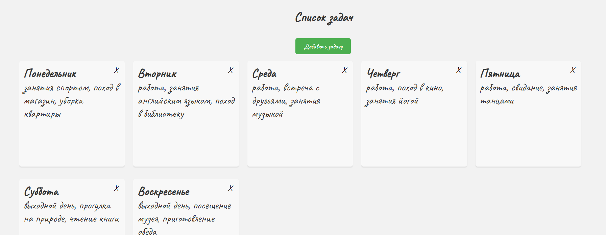

## Простой список дел с возможностью добавления и удаления задач.

---

---

### [Посмотреть проект](https://artemmazin.github.io/to-do/index.html)

---

Проект имеет простой и минималистичный дизайн, созданный с использованием CSS
В проекте применяются технологии:

- файловая стуктура по БЭМ
- структура классов по БЭМ
- адаптивная flexbox - верстка
- javascript
- работа с localStorage
